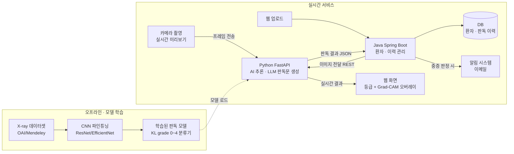

# Knee X-ray KL Grade Classification

무릎 X-ray 영상에서 골관절염 중증도(KL grade 0~4)를 자동으로 분류하는 모델.

## 데이터셋

- 출처: [Mendeley Data](https://data.mendeley.com/datasets/56rmx5bjcr/1)
- `data/raw/` 에 압축을 풀어 저장 (git에는 포함하지 않음)

## 프로젝트 구조

```
data/              # 데이터셋 (git 미포함)
src/               # 학습/추론/API 코드 (Python)
admin-server/      # 관리자 서버 (Spring Boot, Java)
config/            # 학습 설정 (yaml)
checkpoints/       # 학습된 모델 가중치 (git 미포함)
outputs/           # Grad-CAM 등 결과물 (git 미포함)
notebooks/         # Colab 학습 노트북
docker-compose.yml # MySQL (admin-server용)
docs/              # 모델링/기능별 작업 기록
```

## 서비스 아키텍처

점선 없이 화살표는 실시간 서비스 흐름. 카메라 실시간 미리보기는 지연을 줄이기 위해 Java를 거치지 않고 FastAPI에 직접 연결.



## 문서

- [`docs/modeling.md`](docs/modeling.md) — 모델링 실험 기록 및 트러블슈팅
- [`docs/api.md`](docs/api.md) — FastAPI 판독 리포트 서비스 및 트러블슈팅
- [`docs/java-integration.md`](docs/java-integration.md) — Spring Boot 관리자 서버 및 트러블슈팅
- [`docs/camera-realtime.md`](docs/camera-realtime.md) — 브라우저 웹캠 실시간 판독
- [`docs/deployment.md`](docs/deployment.md) — Render 무료 배포 (스마트폰 카메라 테스트용)

## 진행 단계

1. [x] CNN(EfficientNet) 파인튜닝 + Ordinal loss + Grad-CAM
2. [x] FastAPI + LLM 판독 리포트 서비스
3. [x] Java 연동 (관리자 서버: 환자/업로드 이력 관리)
4. [x] 카메라 실시간 처리 (알림 시스템은 별도 진행 중)
